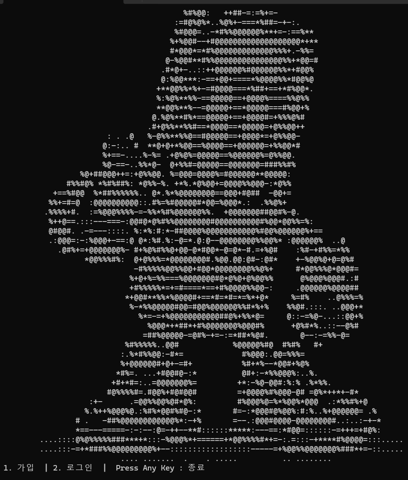

# Monster Hunter
---
## 주제
### - 에너지 드링크를 캐릭터의 회복 아이템으로 활용하는 웹 기반 턴제 RPG 마케팅 게임 제작 
---
## 배경
### - 일반적인 광고 콘텐츠만으로 사용자의 지속적인 관심과 참여가 힘든 온라인 광고 시장에서 게이미피케이션 마케팅을 통해 브랜드 메시지를 전달

## 목적
### - 사용자가 게임을 즐기는 과정에서 HP 회복이라는 요소를 통해 에너지 드링크 브랜드와 제품을 반복적으로 접하고 제품에 대하여 ‘회복’ 키워드 등과 연관된 긍정적인 이미지를 형성
### - 게임 완료 후 할인 쿠폰, 경품 응모 등의 보상을 제공하여 실제 마케팅 전환을 유도

## 필요성
### - 게임형 콘텐츠를 통해 사용자가 직접 행동하고 선택하여 브랜드와 상호작용하는 시간이 증가
### - 캐릭터의 감소한 HP를 회복하는 아이템용으로 에너지 드링크를 활용하여 긍정적인 제품 이미지 형성
### - 짧은 시간 안에 전투의 흐름을 경험하여 브랜드 메시지를 명확하게 전달

## 기대효과
### - 게임 내 에너지 드링크를 HP 회복 아이템으로 반복 노출하여 사용자가 브랜드를 자연스럽게 인식하고, 제품에 대해 ‘회복·에너지’와 연관된 긍정적인 이미지를 형성
### - 게임 완료 후 할인 쿠폰, 경품 응모 등의 보상을 제공하여 사용자의 적극적인 참여를 유도하고 제품 구매까지 이어질 수 있는 마케팅 효과 기대
---
## 주요 내용
### 1. 게임 기본 흐름
#### 게임 시작 -> 캐릭터 생성 -> 1:1 전투 -> 에너지 드링크 아이템 사용 -> 경험치 및 코인 획득 -> 코인 활용 할인 쿠폰 및 경품 응모 등 보상 제공

### 2. 마케팅 전환 유도
#### 게임 완료 후 쿠폰 제공, 경품 응모 등 마케팅 기능을 연계하여 브랜드 경험이 실제 이벤트 참여 및 제품 구매로 이어지도록 유도
---
## 사용한 기술
#### 1. Language:
- Java
- JDBC
#### 2. DataBase:
- MySQL 8.x / AWS Cloud RDS
#### 3. Tool:
- Eclipse
- Intellij
- MySQL-Workbench
- ERD_Cloud
- Notion
- Discord
- Slack
#### 4. 형상관리:
- Git
- GitHub
---
## Made_by
- imnotpossib1e
- sdh02142
- joohyosung
- vincecater1030
---
## 실행 화면
